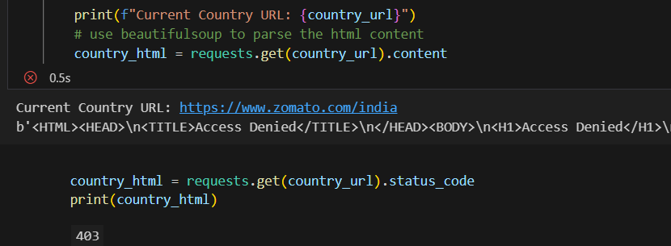

## Table of Contents


## Introduction


## drafts

Since I currently reside in the Middle East, the website redirects me to Beirut, which is unavailable, so we scroll down, and see that only India and UAE can be currently scraped: 


Therefore, we'll be scraping from these two sub-pages only:
```
https://www.zomato.com/india
https://www.zomato.com/uae
```

Note: For the rest of this series, we'll be working with the India sub-page, and then the final code can be executed again but on UAE.

First of all, we want to scrape the restaurants in each of these cities:


Side note: Notice that when we click on any of the cities above, the URL changes to something like this:
```
https://www.zomato.com/agra
```

Remember that, it will come in handy later.

TODO: add sentence below to section where we decide on library to use
This means that if we were to use an HTML parser library (e.g., beautiful soup), then we can just extract the city name from each of the buttons above and add them as suffixes to the base URL in order to quickly access these pages

Now, in this `agra` sub-page, we need to go through each restaurant, and extract the requirements previously mentioned. However, we'll need to either contact the client about the "various categories" (i.e., cuisines like burger, pizzas, etc), or we can just extract all of them! 

We'll go with the latter option :].

The screenshot below shows us that some of the requirements can already be obtained from the `agra` sub-page:


However, these are obviously not all the requirements, so let's check visit one of these restaraunts to see where we can find the rest of the info:


Now, that we know what to scrap and where to scrap it from, we decide on a very important factor: **the library to use for scraping**.


&nbsp;
## Choosing a Library for Scraping

There are many libraries that can be used for scraping, but they can be categorized into two main categories: HTML parsers and HTTP clients:

&nbsp;
### HTML Parsers

These libraries are used to parse HTML pages, and extract the data from them. They are usually used when the data is embedded in the HTML page itself, and not loaded dynamically (i.e., via JavaScript).

Examples of such libraries are:
- [Beautiful Soup](https://www.crummy.com/software/BeautifulSoup/bs4/doc/)
- [lxml](https://lxml.de/)
- [html5lib](https://html5lib.readthedocs.io/en/latest/)
- [html.parser](https://docs.python.org/3/library/html.parser.html)

&nbsp;
### HTTP Clients

These libraries are used to send HTTP requests, and receive HTTP responses. They are usually used when the data is loaded dynamically (i.e., via JavaScript).

Examples of such libraries are:
- [requests](https://docs.python-requests.org/en/master/)
- [aiohttp](https://docs.aiohttp.org/en/stable/)
- [httpx](https://www.python-httpx.org/)
- [urllib](https://docs.python.org/3/library/urllib.html)

&nbsp;
### Extra: Web Browsers

However, it is important to note that libraries like selenium and helium are also used for scraping, but they are not HTTP clients, nor HTML parsers. They are actually web browsers that can be controlled via code, and they are used when the data is loaded dynamically (i.e., via JavaScript).


&nbsp;
### HTTP Clients vs HTML Parsers vs Web Browsers

So, When to use each of these options?

Well, it depends on the website we're scraping from, and the data we're scraping.

For example, if the **data is embedded** in the HTML page itself, **then** we can use an **HTML parser** library like beautiful soup to extract it. We can know this by checking the **page's source code** (right click the page, then click `view page source`), and seeing if the data is there.

However, if the **data is loaded dynamically** (i.e., via JavaScript), then we can use an **HTTP client** library like requests to send a request to the website, and receive the response containing the data. We can know this by two ways:
1. Checking the page's source code, and seeing if the data is there; if not, then it's probably loaded dynamically.
2. Checking the network tab in the developer tools (right click the page, then click `inspect element`, then click `network`), and seeing if the data is loaded dynamically.

Finally, if the data is loaded dynamically (i.e., via JavaScript), and the website is using anti-scraping techniques, then we can use a web browser library like selenium to control a web browser, and scrape the data from it. Unfortunately, there is no quick method to know if the website is using anti-scraping techniques, so we'll have to try scraping it with an HTTP client library first, and if it doesn't work, then we'll try using a web browser library.


&nbsp;
### Checking How The Data is Loaded in Zomato

Now, let's check how the data is loaded in Zomato. We'll do this by checking the page's source code, and the network tab in the developer tools.

First, let's check the page's source code in the `agra` sub-page:


As we can see, the data is not embedded in the HTML page itself, so it's probably loaded dynamically. Side note: If you check the page's source code, you'll notice that the restaurants' data at the top (e.g., La Pino'z Pizza) is actually embedded in the HTML page itself, but it's not the data we're looking for; it's just the data needed to render the page, and then the data we're looking for is loaded dynamically.

However, the data in the main India sub-page is embedded in the HTML page itself, so we can use an HTML parser library to extract the city names from the buttons, and then add them as suffixes to the base URL in order to quickly access these pages.

Now, let's check the network tab in the developer tools in the `agra` sub-page:


As we can see, the data is loaded dynamically, so we'll be using an HTTP client library (`requests`) to scrape it.

However, if we encounter any anti-scraping techniques, then we'll use a web browser library instead.


&nbsp;
## Testing the HTTP Client Library

Now, let's test the HTTP client library (`requests`) to see if it works.

First, we'll send a request to the `india` sub-page, and see if we get a response:



As we can see, we got "Access Denied" (403 status code), but before we jump to conclusions, let's try sending headers with the request:

```python
country_code = requests.get(country_url, headers={'User-Agent': 'Mozilla/5.0'}).status_code
# returns a 200 status code
```

As we can see, we got a response, so the library works :]!


&nbsp;
## Wrap-Up 🙌

Hope you learned a thing or two from the basic setup steps mentioned here :]!

In this series' upcoming post, we'll actually talk about the code responsible for scraping [reedsy.com](https://reedsy.com/)!

If you have any questions/suggestions, don't hesitate to write them in the comment section; this is my first, post on Dev.to, so I still have [a lot to learn](https://dev.to/francescoxx/an-article-to-help-you-to-write-your-first-article-1mgm)! :]🙌!

&nbsp;
## Optional: Extra Content
Mostly unrelated info that I've learned along the way and that might come in handy for other projects :]🙌!

Side-note: If you check this post later and find some of these sub-headers removed, then I've probably created a newer post talking specifically about these removed topics.
