_**TOC:**_

- ["Why Should I join CS When Code Can Be Easily Vibed 🏄‍♂️ ?"](#why-should-i-join-cs-when-code-can-be-easily-vibed-️-)
  - ["Problem Complexity? Huh?"](#problem-complexity-huh)
  - ["Ok, So Does The AI *Vibe* ✨ With All of These Levels?"](#ok-so-does-the-ai-vibe--with-all-of-these-levels)
- ["What You're Saying is a Little Bit Abstract. Examples, Plz?"](#what-youre-saying-is-a-little-bit-abstract-examples-plz)
  - [First - Strategic Thinking (`lvl1`)](#first---strategic-thinking-lvl1)
  - [Next - Technical Decision Making (`lvl2`)](#next---technical-decision-making-lvl2)
  - [Then - Tactical Problem Solving (`lvl3`)](#then---tactical-problem-solving-lvl3)
  - [Finally - Function Implementation (`lvl4`)](#finally---function-implementation-lvl4)
  - [Final Product](#final-product)
  - [Lessons Learned From This Journey](#lessons-learned-from-this-journey)
- [Footnotes and References](#footnotes-and-references)
- [If you Have Any Questions/Suggestions...](#if-you-have-any-questionssuggestions)
- [And If I made a mistake](#and-if-i-made-a-mistake)

---

&nbsp;

This post acts a survival guide for devs. (with a focus on CS students) who are currently in the middle of the "Vibe Coding" wave 🌊. [1]

Actually, I'll phrase this post in a question-answer format while assuming that you are a pessimistic dev. who is not *vibing* with the current AI trends.

&nbsp;

## "Why Should I join CS When Code Can Be Easily Vibed 🏄‍♂️ ?"

First of all, what "code" are you talking about?

You "code" to accomplish a "task". I.e., a "problem" that you want to solve.

These `problems` *can* be categorized into multiple levels of `complexity` ...

&nbsp;

### "Problem Complexity? Huh?"

Yes, here's a simple categorization of the problems that any developer faces in terms of complexity/scope [fn.1]: 

(Explained in this order: `lvl4` -> `lvl3` -> `lvl1` -> `lvl2`)

1. **Simple isolated problems** (`lvl4`): These are the problems that can be *usually* solved using a single **function**. 
   1. For example, reading an audio file from a local file path into RAM. 

2. **Complex isolated problems** (`lvl3`): These are the problems that can be solved using a workflow of multiple logically-connected steps. *Usually*, in a series of function calls. 
   1. For example, downloading audio files from a website, concatenating them, and then converting them to a single audio file. 
   2. Concretely, a `lvl3` problem can be broken down to `lvl4` problems that are connected together.

3. **Abstract connected problems** (`lvl1`): These are *big picture* problems by understanding the *big picture* of a system. These are the problems that made you want to develop the system in the first place. 
   1. Also known as: "high level design (hld)" / "system design" / "system architecture".
   2. For example, a system that allows users to get audio files from a website, then download them as a single audio file.
   3. These are "solved" by having a mental model of:
      1. The exact requirements of the system (i.e., the problem).
      2. The system architecture (i.e., the solution). E.g., "a web app, where the frontend requests the audio files, and backend processes them, and then returns the final audio file to the frontend".
      3. Optionally: We create a prototype with placeholders for the functions that we will implement later (just to mentally visualize the flow of the system). 

4. **Concrete connected problems** (`lvl2`): These are the problems that are solved by specifying the details of the system architecture then implementing them.
   1. Also known as: "low level design (lld)"." 
   2. E.g., react/fastapi for frontend/backend, streamlit for both, etc. python as main language, uv for managing dependencies, etc.
   3. Concretely, a `lvl1` problem is basically a series of `lvl3` problems that are connected together.

Illustration (Shown in this order: `lvl1` -> `lvl2` -> `lvl3` -> `lvl4`):  

&nbsp;

### "Ok, So Does The AI *Vibe* ✨ With All of These Levels?"

Let's visualize how our brains process these different problem levels and when AI assistance is most effective:

```mermaid
graph TD
    %% file name: ai-vibe-brain-diagram.mmd
    %% Main brain structure
    brain((("Human Brain")))
    style brain fill:#f9f9f9,stroke:#555,stroke-width:2px,color:#333

    %% The four levels of thinking with their corresponding approaches
    subgraph "Brain Processing Complexity Levels"
        lvl1["Level 1: Abstract Connected Problems
        (Strategic Thinking)"]
        style lvl1 fill:#FFDDF4,stroke:#ff69b4,stroke-width:3px,color:#333
        
        lvl2["Level 2: Concrete Connected Problems
        (Technical Decision Making)"]
        style lvl2 fill:#E6CCFA,stroke:#9370db,stroke-width:3px,color:#333
        
        lvl3["Level 3: Complex Isolated Problems
        (Tactical Problem Solving)"]
        style lvl3 fill:#B3C0FF,stroke:#0000CD,stroke-width:3px,color:#333
        
        lvl4["Level 4: Simple Isolated Problems
        (Function Implementation)"]
        style lvl4 fill:#D6EBF9,stroke:#87CEFA,stroke-width:3px,color:#333
    end    
    %% AI relationship with each level
    subgraph "AI Assistance Effectiveness"
        ai1["🧠➕🤖 Human-driven
        AI as Consultant
        For novel domains or specialized requirements"]
        style ai1 fill:#FFDDF4,stroke:#ff69b4,stroke-width:2px,color:#333
        
        ai2["🧠➕🤖 Human-guided
        AI as Implementer
        When requirements are well-understood"]
        style ai2 fill:#E6CCFA,stroke:#9370db,stroke-width:2px,color:#333
        
        ai3["🧠➕🤖 / 🤖➕🧠
        Collaborative or AI-driven
        With human oversight"]
        style ai3 fill:#B3C0FF,stroke:#0000CD,stroke-width:2px,color:#333
        
        ai4["🤖➕🧠 AI-driven
        High Accuracy
        Minimal oversight needed"]
        style ai4 fill:#D6EBF9,stroke:#87CEFA,stroke-width:2px,color:#333
    end

    %% Connection between brain and levels of thinking
    brain --> lvl1
    brain --> lvl2
    brain --> lvl3
    brain --> lvl4
    %% Connection between levels and AI usage
    lvl1 --> ai1
    lvl2 --> ai2
    lvl3 --> ai3
    lvl4 --> ai4
    
    %% Human intervention requirements
    subgraph "Human Intervention"
        human1["Level 1 Requires:
        • Domain expertise
        • Specialized knowledge
        • Strategic vision"]
        style human1 fill:#FFDDF4,stroke:#ff69b4,stroke-width:2px,color:#333
        
        human2["Level 2 Requires:
        • Tech stack wisdom
        • Maintenance planning
        • Integration experience"]
        style human2 fill:#E6CCFA,stroke:#9370db,stroke-width:2px,color:#333
        
        human3["Level 3 Requires:
        • Edge case awareness
        • Performance optimization
        • Error handling strategy"]
        style human3 fill:#B3C0FF,stroke:#0000CD,stroke-width:2px,color:#333
        
        human4["Level 4 Requires:
        • Security awareness
        • Performance standards
        • Code review discipline"]
        style human4 fill:#D6EBF9,stroke:#87CEFA,stroke-width:2px,color:#333
    end
    
    %% Connect levels to human intervention
    lvl1 --- human1
    lvl2 --- human2
    lvl3 --- human3
    lvl4 --- human4
```

&nbsp;

Now let's break it down:

(In this order: `lvl4` -> `lvl3` -> `lvl1` -> `lvl2`)

&nbsp;

1. For `lvl4` problems: Yes, AI can [easily vibe](https://www.youtube.com/shorts/6s8qa9Kl5-s) with them. 

&nbsp;

2. For `lvl3` problems: Usually, yes. But...
   1. If the problem is related to a [tech stack](https://distantjob.com/blog/best-tech-stack/) that the AI is not familiar with, then its *vibeage* will be limited.
      1. E.g., if you ask the AI to write a function that uses a library that it doesn't know about.
      2. This can be mitigated by providing the library's docs yes... but this will not always be a possible option. Examples:
         1. Library has outdated docs.
         2. Library has no docs at all.
         3. Library is not open-source, so you can't even clone it and tell AI to read it.
         4. etc.
   2. If you phrase your request in a very strict way, then the AI could overcomplicate the solution. 
      1. E.g., you ask AI to do A/B/C to get D, but if you've just asked it to do D, then it would have done it in a simpler away.
         1. I.e., under-trusting your AI buddy `:[`.
   3. If you phrase your request in a very vague way, then the AI could over-simplify the solution while neglecting important corner cases. 
      1. E.g., you ask AI to return D, but you forgot to mention that D should be in a specific format, or that it should be sorted in a specific way, etc.
         1. I.e., Assuming that your AI buddy is a mind reader `:[`.

&nbsp;

3. For `lvl1` problems: depending on the complexity of the problem you're trying to solve:
   1. For commonly known problems (e.g., "write a full web-based todo app"), it can provide a *big picture* solution (e.g., it will whip up a possible system architecture for you).
   2. For less commonly known problems, the provided *big picture* solution will be less accurate than the previous example.
      1. E.g., if you want to create a app for Islamic prayer times, then it might propose using an outdated GitHub library that calculates prayer times, even though your solution might be better off using an online API service instead.
      2. Well then how do you know which system architecture is more well suited?
         1. You look at your requirements and constraints. For example, if you know that this prayer times app will be mostly working offline, then prefer a calculation library over an online API service, etc.
      3. Therefore, you need to have a good understanding of the problem you're trying to solve, and the requirements/constraints of the system you're trying to build.
         1. This is where your CS knowledge comes in handy! `:]`
      4. Then ***and only then*** can you ask the AI to help you with the *big picture* solution.

&nbsp;

4. For `lvl2` problems: Similar situation to `lvl1` problems;   
   1. If you just give it a high level design (i.e., a `lvl1` solution) and tell it to suggest the suitable tech stack and provide detailed implementation **without** giving it proper requirements/constraints/context, then it may choose **libraries that are not suitable** for your use case down the road.
      1. For example, in the prayer times app, it may suggest an API library that has a monthly limit of 1000 requests, while your app may need to make 2000 requests per month, etc.
      2. Well then how should you have tackled this problem?: By having a *prior experience* on using APIs, so that you can ask questions like "API's rate limit?", "API's server availability?", "API's response time?", etc., and accordingly have an explicit requirement/constraint for the AI to work with.

&nbsp;

## "What You're Saying is a Little Bit Abstract. Examples, Plz?"

Let me map these levels using a real project I recently built: [ayahs-audio-downloader](https://github.com/odyash/ayahs-audio-downloader) - a tool that downloads and concatenates Quranic audio verses.

&nbsp;

### First - Strategic Thinking (`lvl1`)

My journey started with a high-level problem: "I want to create a tool that lets users select a range of Quranic verses, download their audio files, and combine them into a single file."

In my [initial prompt](https://github.com/OdyAsh/ayahs-audio-downloader/blob/b67d032ef74364ff44e67ebe7ccc9a3d7244025c/.specstory/history/2025-05-05_16-16-i-want-api-suggestions-for-the-following.md), I wrote:

> "I input an ayah range (e.g., 2:2 - 2:8), then that API gives me these ayahs with audios, and I then concatenate them together to a single audio file."

I was thinking at the highest abstraction level - what the system should accomplish, not how it would work.

&nbsp;

### Next - Technical Decision Making (`lvl2`)

After exploring available APIs, I made architectural decisions:

1. Use the [Quran API](https://quranapi.pages.dev) for audio files
2. Build a Streamlit web application for the interface
3. Structure the project with separate modules for downloading and processing
4. Use Python with `uv` for dependency management
5. Include FFmpeg via `packages.txt` for Streamlit Cloud deployment

I outlined these requirements in detail:

> "3.1 The user chooses the starting ayah (e.g., 2:1) and the ending ayah (e.g., 2:8)
> 3.2 the user then chooses the reciter of choice...
> 3.3 the user clicks on get audio file..."

&nbsp;

### Then - Tactical Problem Solving (`lvl3`)

Next, I broke down the main functionality into discrete problems:
1. Downloading audio files for a range of verses
2. Concatenating audio files into a single MP3
3. Handling the UI flow with Streamlit

Each of these needed a specific implementation strategy. For example, the audio concatenation process required:
- Loading each audio file with PyDub
- Joining them sequentially
- Handling errors if any file failed to process

&nbsp;

### Finally - Function Implementation (`lvl4`)

At the lowest level, I had individual functions like:
- `parse_ayah_reference()` - Parse an input like "2:5" into surah and ayah numbers
- `get_reciter_id_by_name()` - Map reciter names to their IDs
- `download_ayah_audio()` - Download a single audio file
- `generate_output_filename()` - Create a standardized filename

These are simple, isolated functions that each do one thing well.

This workflow - starting with the big picture (lvl1), making architectural choices (lvl2), breaking it into major components (lvl3), and finally writing individual functions (lvl4) - represents a much more efficient approach than jumping straight to coding without proper planning.

### Final Product

The Streamlit 👑 app can be accessed here: https://ayahs-audio-downloader.streamlit.app/

App demo:

App's architecture:

([source](https://deepwiki.com/OdyAsh/ayahs-audio-downloader#component-diagram))

&nbsp;

### Lessons Learned From This Journey

1. **Importance of Planning**: If I had taken more time to plan the project, I could have avoided some of the pitfalls I encountered. Examples:
   1. I didn't *think* which audio-processing library I should choose. Instead, I relied on the AI model (i.e., copilot) to suggest one for me.
      1. It chose `pydub` which is a great library, but it internally uses `ffmpeg`, which isn't a python library. So I had to install it separately.
      2. If I had just *thought* about it, I would have realized that most audio-processing libraries use `ffmpeg` under the hood anyways, so I would've indicated to copilot a new constraint:
         1. "I want to use a library that doesn't require any external dependencies".
         2. Or: "I'm later uploading this to streamlit cloud, so read [the streamlit docs](https://docs.streamlit.io/deploy/streamlit-community-cloud/deploy-your-app/app-dependencies) to see how it handles external dependencies and act accordingly"
         3. Etc.
2. **Think of Dependencies That The AI Might Want to Know About**: Examples:
   1. Stating that the solution will be eventually deployed to streamlit cloud would have helped copilot act accordingly on how to install `ffmpeg`.
   2. Stating that the solution will use Python 3.13 could have helped copilot choose libraries that are compatible with it.
      1. For example, it chose `pydub`, which turned out to have issues with Python 3.13, so I had to downgrade to 3.11.
      2. However, I'm skeptical about this tip. I.e., I'm skeptical that copilot is trained enough to know that certain python libraries have issues with certain python versions. So I wouldn't rely on this tip too much.
3. **Ride The Vibe Tech Wave**: There is so many tools/websites out there that can help you with your workflow/docs. Examples:
   1. GitHub Copilot: [Enough said](https://www.youtube.com/watch?v=dutyOc_cAEU).
   2. [Deep Wiki](https://deepwiki.com/): A website that indexes your public GitHub repos and provide nice docs for it.
      1. E.g.: https://deepwiki.com/OdyAsh/ayahs-audio-downloader
   3. Generate [mermaid diagrams](https://mermaid.js.org/intro/) with AI. 
      1. Details: [Medium article](https://mike-vincent.medium.com/llm-mermaid-how-modern-teams-create-uml-diagrams-without-lucidchart-e54c56350804).
      2. Even the diagrams in this article are generated using mermaid `:]`.
   4. [SpecStory](https://marketplace.visualstudio.com/items?itemName=SpecStory.specstory-vscode) Extension: An IDE extension that tracks/saves your conversation's with the IDE's AI model (e.g., copilot).
      1. For example, check out the markdown files [here](https://github.com/OdyAsh/odyash-dev.to/tree/main/.specstory/history) to see how I made this article `;]`.
   5. Use AI as your "friendly neighbourhood plumber" [2].
      1. Updated your codebase and now you're dreading the README.md and docs/*.md documentation? Just ask the AI to do it for you.
      2. Need to manually change file references? Let the AI create a VSCode task that will [automatically do this for you](../../docs/update-dev-to-git-json-upon-save.md) <3. 
      3. and so on...
      4. See the pattern here? The 2 problems above are `lvl2`, so [prompt the AI succinctly](../../.specstory/history/2025-05-11-auto-update-json-logic.md), and the AI will return a mostly working solution `:]`.
4. **Just Because You Can Vibe, Doesn't Mean You Should**: 
   1. I did some problem-solving by myself (e.g., `lvl3`, parts of `lvl4`).
   2. Yet, I still relied on the AI for most of the implementation (e.g., majority of `lvl4`, which is a series of `lvl2`/`lvl1` problems that the AI defined and solved).
   3. However, what helped me is that I already had a mental *big picture* on how a problem like this can be solved and what tech stack is suitable for it.

What I'm trying to say is this: Only when you're comfortable with problem solving, system designing, and experiencing different tech stacks hands-on, then you can start relying on the AI to do the *vibing* for you 🏄‍♂️✅:

Otherwise, you will be lost in the middle of the vibe waves, and you won't know how to swim back to shore 🏊‍♂️❌:

&nbsp;

## Footnotes and References

[fn.1]: These levels of complexity are completely subjective, and they are not based on any scientific research. They are just a way for me to mentally categorize a problem when I see it.

[1]: Cover art by [Pete Sena](https://petesena.medium.com/?source=post_page---byline--124b9288e551---------------------------------------): "[Cracking the code of vibe coding](https://uxdesign.cc/cracking-the-code-of-vibe-coding-124b9288e551)" medium article. Side logos by flaticon.com ([computer science](https://www.flaticon.com/free-icon/computer-science_5044590), [problem solving](https://www.flaticon.com/free-icon/problem-solving_6487594))

[2]: [The Bulk of Software Engineering is Just Plumbing, by Karl Hughes](https://www.karllhughes.com/posts/plumbing)

&nbsp;

## If you Have Any Questions/Suggestions...

Your participation is most welcome! 🔥🙌

&nbsp;

## And If I made a mistake

Then kindly correct me by:

* Writing a comment ✍️
* Or opening a PR on [GitHub](https://github.com/OdyAsh/odyash-dev.to/tree/main/blog-posts) 
  * [Details](https://dev.to/maxime1992/manage-your-dev-to-blog-posts-from-a-git-repo-and-use-continuous-deployment-to-auto-publish-update-them-143j#:~:text=%0A%20%20%0A%20%20Found%20a%20typo%3F%0A)

 See ya! `:]` 🙌

