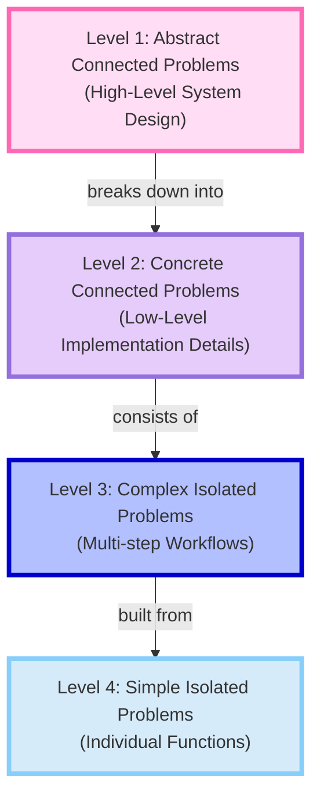

```mermaid
graph TD
    %% Problem complexity levels
    lvl1["Level 1: Abstract Connected Problems
    (High-Level System Design)"]
    style lvl1 fill:#FFDDF4,stroke:#ff69b4,stroke-width:4px,color:#333

    lvl2["Level 2: Concrete Connected Problems
    (Low-Level Implementation Details)"]
    style lvl2 fill:#E6CCFA,stroke:#9370db,stroke-width:4px,color:#333

    lvl3["Level 3: Complex Isolated Problems
    (Multi-step Workflows)"]
    style lvl3 fill:#B3C0FF,stroke:#0000CD,stroke-width:4px,color:#333

    lvl4["Level 4: Simple Isolated Problems
    (Individual Functions)"]
    style lvl4 fill:#D6EBF9,stroke:#87CEFA,stroke-width:4px,color:#333

    %% Define the hierarchy
    lvl1 -->|"breaks down into"| lvl2
    lvl2 -->|"consists of"| lvl3
    lvl3 -->|"built from"| lvl4
```
