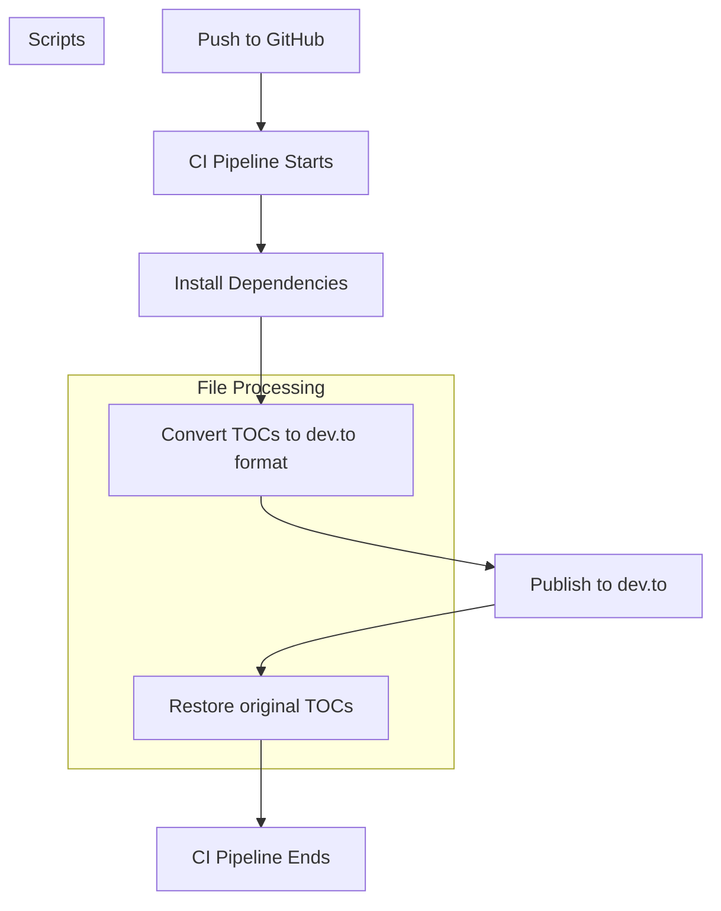

# Dev.to-Compatible TOC Processing: Problem, Solution, and Automation

## The Problem

Markdown files often contain a Table of Contents (TOC) with anchor links that work on GitHub but are not compatible with dev.to's anchor rules. For example, dev.to requires:
- No double hyphens in anchors (e.g., `#first---strategic-thinking-lvl1` → `#first-strategic-thinking-lvl1`)
- Special handling for code/backtick content in TOC (e.g., `` `lvl1` `` → `-raw-lvl1-endraw-` in the anchor)
- Removal of invisible/emoji characters from anchors

## The Solution

A set of scripts and a CI pipeline were implemented to:
- Automatically convert all TOCs in markdown files to dev.to-compatible format before publishing
- Restore the original TOCs after publishing, so local files remain unchanged

### Key Files and Their Roles

- **scripts/markdown-toc-to-devto-toc.js**
  - Locates the TOC block in a markdown file (by searching for a line containing 'TOC' or 'table of content(s)', case-insensitive)
  - Allows for any number of blank lines after the header, and preserves them
  - Removes emoji/invisible characters from the TOC block
  - For each TOC entry:
    - Collapses double hyphens in the URI
    - Replaces backtick content in the alt text with `-raw-...-endraw-` in the URI
    - Ensures `-raw-` and `-endraw-` are always surrounded by hyphens
  - Returns the markdown content with the updated TOC block

- **scripts/apply-devto-toc-to-md-files.js**
  - Reads the list of markdown files from `dev-to-git.json`
  - For each file:
    - Creates a backup (`<file>-original-toc.md`)
    - Converts the TOC using `markdown-toc-to-devto-toc.js`
    - Overwrites the original file with the dev.to-compatible TOC
  - Used in the CI pipeline before publishing to dev.to

- **scripts/return-md-files-to-original-toc.js**
  - Restores the original TOC from backup after publishing
  - Used in the CI pipeline after publishing to dev.to

## The Automation Pipeline

The `.github/workflows/main.yml` pipeline:
- Runs on every push
- Installs dependencies
- Runs the TOC conversion tests (`tests/test-toc-scripts.js`) to verify the logic end-to-end
- Runs `apply-devto-toc-to-md-files.js` to convert TOCs before publishing
- Publishes to dev.to
- Runs `return-md-files-to-original-toc.js` to restore original TOCs

## When Is This Used?
- Every time you push to the repository, the CI pipeline ensures your markdown files are published to dev.to with the correct TOC format, and your local files are left unchanged. The TOC conversion logic is tested on every push to catch regressions early.

## For More Details
- See the code comments in each script for a step-by-step explanation of the logic and transformation.
- See the test script in `tmp/test-toc-scripts.js` for end-to-end verification of the process.

## Flowchart of the overall solution

